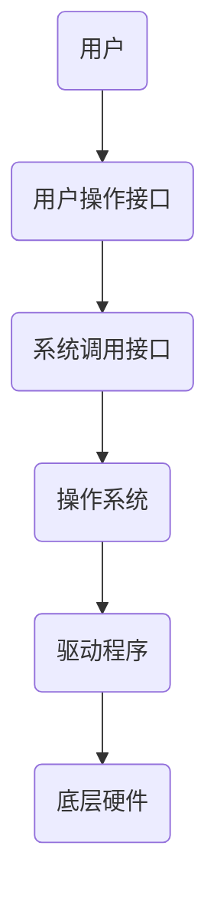

## Linux学习笔记（6）

> **本节对学习进行记录，而不进行完全的阐述**
>
> **这篇文章很多地方博主讲的不清楚，因为我自己也还没理解透彻**
>
> **仅作学习记录**

### 🍭冯诺依曼体系结构


🍊输入设备:  键盘、网卡、话筒

🍊存储器:  通常指的内存

存储器通常指的是内存，不考虑缓存,这里的CPU只能对内存进行读写，不能访问外设

🍊运算器和控制器 ： CPU

🍊输出设备:显示器、网卡、音响

> 键盘、网卡、显示器等都可以被称为外设

> 内存:


🍊**先说结论**：在冯诺依曼体系下，**所有的设备都只能直接和内存打交道**。

**解释**：在冯诺依曼体系下，输入输出设备，CPU（控制器和运算器）都只能和内存进行交互，即外设输入或输出数据，也只能写入内存或者从内存中读取

**原因**：相对CPU来说，输入输出设备的速度是比较慢的，而CPU处理数据的速度很快，如果不经过内存，就会导致不能完全发挥CPU的性能，也即**木桶效应**。

> 🍊如果让CPU直接访问外设，CPU会浪费大量的时间等待外设返回的数据，为了不让CPU闲着，就出现了内存，内存（存储器）的速度又远快于外设，当然是低于CPU的，所以就出现了外设的数据流都要先经过内存，由内存传给CPU处理，返回的数据当然还是在内存，再由内存传给输出设备这种情况。
>
> **内存的存在提高了CPU的效率**
>
> **速度**：CPU>存储器>输入输出设备
>
> 高速缓存一般不看，**越上面的越靠近CPU越快，反之越慢**
>
> 


> qq开始甲和乙聊天开始，甲发消息， 数据流动的过程（冯诺依曼规定了硬件层面的数据流向）
>
> 甲的网卡 ->甲电脑的内存 -> 甲的CPU -> 乙的网卡 ->乙电脑的内存->乙的CPU->乙的内存 ->乙的屏幕

> 小知识:可执行程序运行的时候 必须先加载到内存 


### 🍭简单介绍操作系统（operating system，简称OS）

> :pear:操作系统是什么？
>
> **管理** 计算机硬件 与 软件 资源的 计算机程序

> :pear:为什么要有操作系统？（这个问题完全可以单独拿出来写一篇博客，可以百度）
>
> 简单来说：
>
> 1.方便用户使用，比如windows就带有图形界面
>
> 2.对上，给使用的用户、开发人员等提供一个良好的运行环境，比如比较稳定，打游戏不会突然因为操作系统的原因掉线之类的
>
> 3.对下，管理好底层相关的软件硬件资源

> :pear:理解管理
>
> 举个例子，校长如何管理学生，辅导员提取每个人的信息进学生管理系统，校长通过学生管理系统做决策，决策的具体执行就是在学生管理系统对学生的数据进行处理，比如校长要开除你，那直接把你的数据删掉就行了，此后排课之类的都不算上你[doge],具体的执行就是辅导员操作。这里面校长就相当于CPU，负责管理，辅导员相当于执行者，类比的可以是驱动程序，学生就相当于被管理者，也就是资源。**换个角度，对学生的管理就转换成了对学生信息的增删查改.**
>
> 通过上面看出，管理就是抽离出数据，再对数据进行操作
>
> <font color=red >**:pear:总结：先描述，再组织**</font>
>
> 套回上面那个例子，描述就是你的属性（身高体重联系方式之类的），那就是你的数据，组织就比如通过数据结构把你从学生管理系统删除
>
> 管理是通过属性进行的

> :pear:计算机体系是一个层状结构，任何访问硬件或系统软件的行为都必须经过操作系统
>
> 因为操作系统不信任用户，用户的对软硬件的操作都必须要经过操作系统，**操作系统会提供相应的接口**，换句话说，经过操作系统得通过操作系统提供的接口

层次图：





> 以C程序举例
>
> C语言里的printf和scanf需要调用系统接口
>
> 
>
> 按我们的习惯，第一行肯定要写#include<stdio.h>
>
> 注：写#include<stdio.h>是因为头文件里有一些库函数的声明，比如printf和scanf
>
> 而上面的test.c里并没有出现printf和scanf等操作，所以这几行代码都是属于用户层面的，并不需要调用系统接口，自然是可以通过编译链接的
>
> 换言之，这几行代码都是属于你的，和操作系统没有关系。

操作系统把代码转化为指令交给CPU执行

### 进程

🍈概念：程序的一次执行过程

> windows下
>
> 
>
> 任务管理器下即可看到进程

🍈PCB（process control block）:进程控制块，可以看作是进程属性的集合

作用：描述进程，Linux系统下的PCB是task_struct

> 小知识：Linux是用C写的，在C语言里能描述一个事物的属性的变量自然是结构体变量

🍈社会上我们的身份证可以表示我们的身份，也就是我们的ID

Linu如何表示进程呢？

**进程也有自己的ID，称作PID**，通过PID就可以表示一个进程

假如Linux下我们写一段C代码：

```c
test.c
#include<stdio.h>    
#include<unistd.h>    
int main()    
{    
  int a;    
  a=1+1;    
  while(1)    
  {    
  printf("I am a process,pid::%d\n",getpid());  
     			//getpid()是得到当前进程ID的一个函数                         
    sleep(1);    
  }    
  return 0;    
} 
```

写完后，test.c编译链接生成可执行程序test，通过系统接口给到操作系统，操作系统新建一个进程来运行test.

🍈**Linux下查看进程**

🍍ps命令查看进程

🍒ps aux |grep test


上面就是进程的具体信息

可以和grep配合使用查找想看的进程，比如此时我们运行test


显然，26543就是test进程的ID了.

🍒ps axj

> ps axj |grep 关键字
>
> 组合grep可以筛选进程


🍒 ps axj |head -数字 &&ps axj| grep  关键字


🍒 进程也有父进程，可以通过函数getppid（）看到

```c
#include<stdio.h>    
#include<unistd.h>    
int main()    
{    
  int a;    
  a=1+1;    
  while(1)    
  {    
  printf("I am a process,pid::%d,my father is%d\n",getpid(),getppid());    
    sleep(1);    
  }    
  return 0;    
} 
```

运行：


pid就是当前进程的编号，这里就是27848，父进程的编号（PPID）是20197

> 🍒 这个20197又是什么进程？
>
> 通过：ps axu|grep 20197
>
> 
>
> bash是我们登录时就创建的

🍍top   也可以看到进程信息

**按q退出**


🍍在 proc目录内也可以看到进程的相关信息

proc目录在根目录下

🍍cd /proc


cd 20197  进入20197，里面的文件就是进程属性的记录


🍍**上下文数据**：进程执行时cpu内的寄存器的数据

>进程切换时需要保存数据
>
>比如进程1在运行，运行了一段时间优先级更高的进程2来了，进程1就要暂停，把资源让给进程2，此时进程1的数据就要被保存到PCB中，不然之后不能继续运行，进程2运行完了后，要回到进程1，就必须恢复进程1的数据，这些数据就是上下文数据

> 随笔记录：CPU只看PCB

🍍进程切换的例子：优先级高的进程来了  时间片到了


> 🍍时间片是什么？
>
> CPU公平分配资源的策略就是运行一段时间后切换到另一个进程
>
> 一个进程A在cpu上跑，如果这个进程A需要很久才能跑完的话，那别的进程在CPU运行进程A时就不能获得资源，而CPU公平分配资源的策略就是运行一段时间后切换到另一个进程，比如进程A跑了10ms，之后保存进程A的数据（上下文数据，利于恢复），此时切换到进程B，进程B也跑10ms，再保存数据切换到进程A，这里的时间片就是10ms

🍍上下文的保存与恢复:场景就是切换进程

